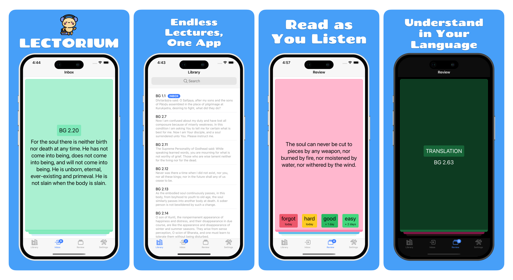

    

<i>
Lectorium is your personal lecture companion — listen to your lectures, read accurate transcripts, and ask questions anytime, anywhere. Whether you're commuting, walking, or relaxing at home, Lectorium makes learning accessible and interactive on the go.
</i>

  
  
  

# Features

🎓 Dive into a World of Knowledge
Unlock access to thousands of inspiring lectures from top thinkers, creators, and educators — all in one place.

🎧 Take Your Learning Offline
No Wi-Fi? No problem. Download your favorite lectures and take them with you wherever life happens.

📖 Read While You Listen
Follow along with perfectly synced transcripts — read, rewind, and revisit key moments effortlessly.

🌐 Learn in Your Language
Instantly translate any lecture into your preferred language. Learning has no borders.

🤖 Ask Anything, Anytime
Got questions? Lectorium lets you ask and get answers straight from the lecture content — like having a professor in your pocket.

# Get involved

If you'd like to help develop the project, here's a list of links to get you started:

1. [Development Environment](<docs/development environment.md>) – Configure your development enviroment to get started.
2. [Good First Issues](https://github.com/akdasa-studios/lectorium/issues?q=is%3Aissue+is%3Aopen+label%3A%22good+first+issue%22) – a list of simple issues any developer could start from.
3. [Roadmap](https://github.com/orgs/akdasa-studios/projects/14/views/2) - list of tasks we are working on.
